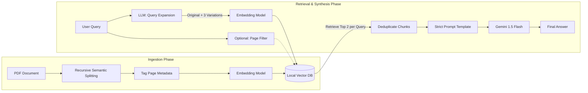

```markdown
# ScholarRAG 📚🤖

A local, terminal-based **Retrieval-Augmented Generation (RAG)** system built to chat with dense technical research papers. 

Instead of relying on an LLM's general (and sometimes hallucinated) knowledge, ScholarRAG ingests a specific PDF document, converts the text into mathematical vectors, and uses a strict prompt template to force the AI to answer questions using **only** the provided academic context.

This repository serves as a learning sandbox, demonstrating the progression from a basic "Naive" RAG pipeline to an optimized "Intermediate" system.

```

## 🏗️ System Architectures

### Level 1: Naive RAG (`NaiveRAG.py`)
This system implements a baseline pipeline. It reads a document, slices it into fixed chunks, and retrieves the most mathematically similar pieces of text to answer a user's query.


### Level 2: Intermediate RAG (`IntermediateRAG.py`)
This upgraded system introduces **Pre-Retrieval Optimization** to fix the blind spots of Level 1. It utilizes smart chunking to preserve paragraph meaning, query expansion to handle poorly-worded user questions, and metadata filtering for targeted searches.


---

## ⚙️ Design Choices Evolution

To demonstrate how RAG systems scale, we altered our engineering choices across the five core pillars of RAG design between Level 1 and Level 2:

* **Indexing:** 
  * *Level 1:* Naive Character Splitting (cuts text exactly at 1000 characters, sometimes breaking sentences).
  * *Level 2:* **Recursive Character Splitting** (prioritizes splitting by paragraphs and lines to preserve semantic meaning).
* **Storing:** 
  * *Level 1:* Raw text vectors stored in ChromaDB.
  * *Level 2:* **Metadata Injection** (attaches the specific source page number to every chunk before saving to ChromaDB).
* **Retrieval:** 
  * *Level 1:* Strict Top-K (k=3) similarity search.
  * *Level 2:* **Query Expansion & Filtering** (An LLM translates the user's query into 4 distinct search terms to cast a wider net, deduplicates the results, and allows the user to pre-filter by page number).
* **Synthesis:** Both levels use Gemini 2.5 Flash with a strict, anti-hallucination prompt.
* **Evaluation:** Currently reliant on manual human inspection of the terminal output.

---

## 🛠️ Tech Stack

* **PDF Extraction:** `PyMuPDF` (`fitz`)
* **Text Splitting (Level 2):** `langchain-text-splitters`
* **Embeddings:** `sentence-transformers` (`all-MiniLM-L6-v2`)
* **Vector Database:** `chromadb`
* **LLM Engine:** `google-generativeai` (Gemini API)
* **Environment Management:** `python-dotenv`

---

## 💻 Installation & Setup

**1. Clone the repository:**
```bash
git clone [https://github.com/AryanGusain-dev/ScholarRAG.git](https://github.com/AryanGusain-dev/ScholarRAG.git)
cd ScholarRAG
```

**2. Create a virtual environment & install dependencies:**
```bash
python -m venv venv
source venv/bin/activate  # On Windows use: venv\Scripts\activate
pip install PyMuPDF sentence-transformers chromadb google-generativeai python-dotenv langchain-text-splitters
```

**3. Set up your API Key:**
Get a free API key from [Google AI Studio](https://aistudio.google.com/). Create a file named `.env` in the root directory and add your key:
```env
GEMINI_API_KEY="your_api_key_here"
```

**4. Add your document:**
Place the research paper you want to analyze in the root directory and name it `sample.pdf` (or update the filename in the scripts).

---

## 🏃‍♂️ Usage

You can test and compare the different architectures by running their respective scripts. 

*(Note: On the first run of either script, the system will process the PDF and build a local database folder. Subsequent runs will detect the existing database and load instantly.)*

**To run the baseline system:**
```bash
python NaiveRAG.py
```

**To run the upgraded system (with Query Expansion and Metadata Filtering):**
```bash
python IntermediateRAG.py
```
