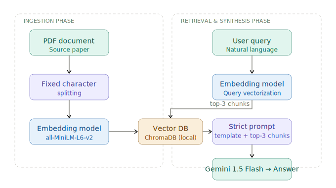
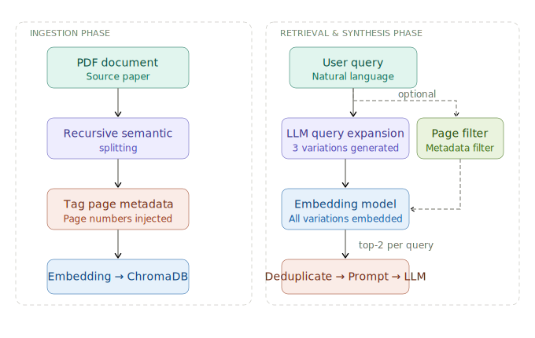
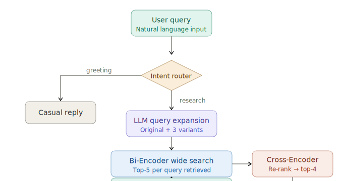
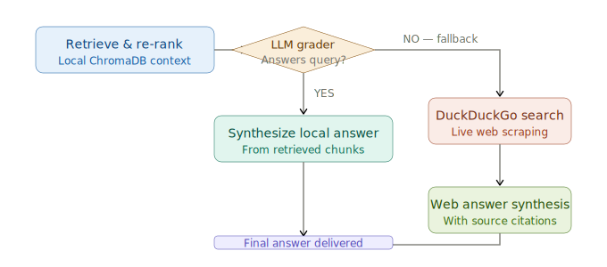

# ScholarRAG 📚🤖

A local, interactive **Retrieval-Augmented Generation (RAG)** system designed to have precise, well-grounded conversations with dense technical research papers.

Instead of relying on an LLM's general (and sometimes hallucinated) knowledge, ScholarRAG ingests specific PDF documents, converts their text into mathematical vector representations, and uses strict prompt templates to force the AI to answer **only** from the provided academic context — no fabrication, no guesswork.

This repository is a **progressive learning sandbox**. It documents the evolution of a RAG pipeline across five architectural levels: from a simple "Naive" baseline to a full agentic, self-healing web application — with each level addressing concrete failure modes from the level before it.

---

## Table of Contents

- [Why ScholarRAG?](#why-scholarrag)
- [System Architectures](#system-architectures)
  - [Level 1 — Naive RAG](#level-1--naive-rag)
  - [Level 2 — Intermediate RAG](#level-2--intermediate-rag)
  - [Level 3 — Agentic RAG](#level-3--agentic-rag)
  - [Level 4 — RAG Evaluation](#level-4--rag-evaluation)
  - [Level 5 — Self-Healing RAG](#level-5--self-healing-rag)
- [Design Choices Evolution](#design-choices-evolution)
- [Tech Stack](#tech-stack)
- [Installation & Setup](#installation--setup)
- [Usage](#usage)

---

## Why ScholarRAG?

Standard LLMs are trained on broad corpora. When you ask them about a specific paper — particularly a recent or niche one — they either hallucinate plausible-sounding details or give overly vague answers. ScholarRAG solves this by grounding every response in actual retrieved text from a document you supply.

The "strict prompt template" at the heart of the system explicitly instructs the LLM: if the answer is not in the retrieved context, say so. This makes ScholarRAG considerably more reliable than a raw LLM call for research-specific Q&A.

---

## System Architectures

### Level 1 — Naive RAG

**What it does:** A minimal working baseline. The document is sliced into fixed-size character chunks, each chunk is embedded and stored in a local vector database, and the user's query is embedded and matched against the stored chunks using cosine similarity. The top-3 most similar chunks are retrieved and passed to the LLM along with a strict prompt template.

**What it gets right:** Simple, fast, and easy to debug. Good enough for straightforward factual queries.

**What it gets wrong:** Fixed character splitting is blind to semantic boundaries — it will happily split a sentence in half, cutting context in a way that makes chunks meaningless. The query is used verbatim, so a poorly phrased question leads directly to poor retrieval. There is no metadata, so every chunk is treated identically regardless of where in the document it came from.



---

### Level 2 — Intermediate RAG

**What it does:** Addresses the three main failure modes of Level 1 through **pre-retrieval optimisation**. On the ingestion side, it switches to recursive semantic splitting (which preserves paragraph and sentence boundaries) and injects page-number metadata into every chunk. On the retrieval side, it introduces query expansion — an LLM generates three alternative phrasings of the user's query, each is embedded and searched independently, and results are deduplicated before synthesis. An optional page-range filter lets users narrow the search to specific sections of the paper.

**What it gets right:** Semantic chunking means retrieved text is coherent. Query expansion catches cases where the user's phrasing doesn't match the document's vocabulary. Metadata filtering gives the user targeted control.

**What it gets wrong:** Query expansion introduces latency (an extra LLM call before retrieval). The ranking of retrieved chunks is still based purely on embedding similarity, which is a shallow signal — a chunk can score high on similarity while being only tangentially relevant to the actual question.



---

### Level 3 — Agentic RAG

**What it does:** Introduces two significant architectural upgrades: an **intent router** and a **two-stage retrieval pipeline**.

The intent router is a fast LLM classifier that reads the user's message and decides whether it is a conversational greeting (in which case the agent replies casually without touching the vector database) or a genuine research query (in which case retrieval is triggered). This prevents irrelevant database lookups and makes the system feel natural to interact with.

The two-stage retrieval works as follows: query expansion generates variants as in Level 2, but retrieval is now handled by a **Bi-Encoder** (the same `sentence-transformers` model, used for fast approximate search across the full corpus — top-5 per query variant) followed by a **Cross-Encoder re-ranker**. The Cross-Encoder is a far more computationally intensive model that jointly encodes the query and each candidate chunk together, producing a precise relevance score. The top-4 re-ranked chunks are then passed to the LLM.

**What it gets right:** The Cross-Encoder re-ranker significantly improves precision — it can distinguish between a chunk that merely shares vocabulary with the query and one that actually answers it. The intent router removes friction for conversational interactions.

**What it gets wrong:** Retrieval is entirely local. If the user asks a question outside the scope of the ingested document — either because the paper doesn't cover it, or because they forgot to upload the right file — the system can only return a "context not found" response. There is no fallback.



---

### Level 4 — RAG Evaluation

**What it does:** Rather than relying on qualitative human inspection, Level 4 introduces an automated testing framework using the **Ragas** evaluation library and an "LLM-as-a-judge" approach.

A set of 15 predefined question-and-ground-truth-answer pairs is tested against the Level 3 pipeline. Four metrics are computed:

| Metric | What it measures |
|---|---|
| **Context Precision** | Of all the chunks retrieved, what fraction were actually relevant? |
| **Context Recall** | Did the retrieval surface all the chunks needed to answer the question? |
| **Faithfulness** | Is the generated answer supported by the retrieved context, or does the LLM add information from outside it? |
| **Answer Relevancy** | Does the generated answer actually address the user's question? |

**Why this matters:** These four metrics expose different failure modes independently. A system can score well on recall but poorly on faithfulness (retrieves the right chunks but the LLM ignores them). Tracking them separately helps pinpoint exactly where a pipeline degrades as you make changes.

---

### Level 5 — Self-Healing RAG

**What it does:** Adds a **grader gate and internet fallback** on top of the Level 3 agentic pipeline.

After retrieval and re-ranking, an LLM acting as a "strict grader" evaluates whether the retrieved local context is actually sufficient to answer the user's question. If it is, synthesis proceeds as normal. If it is not — either the question is out of scope, or the relevant passage wasn't indexed — the agent dynamically triggers a **DuckDuckGo live web search**, scrapes the results, and synthesises an answer from the web context instead, including source citations.

This creates a pipeline that degrades gracefully: it always tries the trusted local source first, but never leaves the user with a dead end.



---

## Design Choices Evolution

The five levels systematically evolve across five core RAG engineering dimensions:

| Dimension | Level 1 | Level 2 | Level 3–5 |
|---|---|---|---|
| **Chunking** | Fixed character splitting | Recursive semantic splitting | Recursive semantic splitting |
| **Metadata** | None | Page numbers injected | Page numbers injected |
| **Retrieval** | Top-K cosine similarity | Top-K with query expansion | Two-stage Bi-Encoder + Cross-Encoder re-ranking |
| **Evaluation** | Manual inspection | Manual inspection | Automated Ragas (Level 4) |
| **Robustness** | None | None | Self-healing web fallback (Level 5) |

Each transition is motivated by a concrete failure mode, not just a desire to add complexity.

---

## Tech Stack

| Layer | Technology |
|---|---|
| **Frontend** | Streamlit |
| **Document parsing** | PyMuPDF (`fitz`) |
| **Semantic chunking** | LangChain Text Splitters |
| **Embeddings (Bi-Encoder)** | `sentence-transformers` — `all-MiniLM-L6-v2` |
| **Re-ranking (Cross-Encoder)** | `sentence-transformers` — `ms-marco-MiniLM-L-6-v2` |
| **Vector database** | ChromaDB (local, persistent) |
| **LLM engine** | Google Gemini 1.5 Flash (via `google-generativeai`) |
| **Automated evaluation** | Ragas |
| **Web fallback** | `duckduckgo-search` |

---

## Installation & Setup

**1. Clone the repository:**
```bash
git clone https://github.com/yourusername/ScholarRAG.git
cd ScholarRAG
```

**2. Create a virtual environment and install dependencies:**
```bash
python -m venv venv
source venv/bin/activate        # Windows: venv\Scripts\activate
pip install -r requirements.txt
```

**3. Configure your API key:**

Get a free API key from [Google AI Studio](https://aistudio.google.com/). Then either:

- Create a `.env` file in the project root:
  ```
  GEMINI_API_KEY="your_key_here"
  ```
- Or enter it directly into the Streamlit sidebar when the app launches.

---

## Usage

**Launch the application:**
```bash
streamlit run app.py
```

The app opens at `http://localhost:8501`. From there:

1. **Upload a PDF** via the sidebar — any research paper or technical document works.
2. **Select an architecture level** using the radio buttons (Level 1 through 5).
3. **Ask questions** in natural language. The system will retrieve relevant context from your document and answer within it.
4. **Compare levels** by asking the same question across different architectural modes to observe how retrieval quality, latency, and robustness change.

> **Tip:** Start with Level 1 to get a feel for the baseline, then switch to Level 3 for the same query to see how the intent router, query expansion, and re-ranking change the answer quality. Use Level 5 when you want to ask questions that your document may not fully cover.
