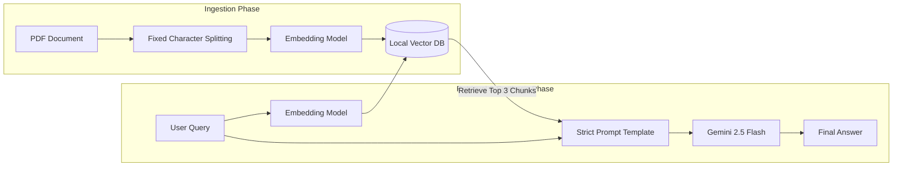

# ScholarRAG 📚🤖

A local, terminal-based **Naive Retrieval-Augmented Generation (RAG)** system built to chat with dense technical research papers. 

Instead of relying on an LLM's general (and sometimes hallucinated) knowledge, ScholarRAG ingests a specific PDF document, converts the text into mathematical vectors, and uses a strict prompt template to force the AI to answer questions using **only** the provided academic context.

---

## 🏗️ System Architecture (Level 1: Naive RAG)

This system implements a baseline "Naive" pipeline. It reads a document, slices it into fixed chunks, and retrieves the most mathematically similar pieces of text to answer a user's query.



---

## ⚙️ Baseline Design Choices

To build this foundational pipeline, specific engineering choices were hardcoded across the five core pillars of RAG design:

- **Indexing:** We utilize a naive Character Splitting Method with fixed hyperparameters (Chunk Size: 1000 characters, Overlap: 100 characters) to slice the PDF.

- **Storing:** Data is persisted locally using ChromaDB. Metadata selection is currently bypassed to prioritize simple text retrieval.

- **Retrieval:** The system uses a strict Top-K retrieval parameter (k=3) based on vector similarity, with no minimum similarity cutoff.

- **Synthesis:** Powered by Gemini 2.5 Flash. The System Prompt is highly restrictive, instructing the model to reject the question if the answer cannot be found exclusively in the retrieved chunks.

- **Evaluation:** Currently reliant on manual human inspection of the terminal output.

---

## 🛠️ Tech Stack

- **PDF Extraction:** PyMuPDF (fitz)
- **Embeddings:** sentence-transformers (all-MiniLM-L6-v2)
- **Vector Database:** chromadb
- **LLM Engine:** google-generativeai (Gemini API)
- **Environment Management:** python-dotenv

---

## 💻 Installation & Setup

**1. Clone the repository:**

```bash
git clone https://github.com/yourusername/ScholarRAG.git
cd ScholarRAG
```

**2. Create a virtual environment & install dependencies:**

```bash
python -m venv venv
source venv/bin/activate  # On Windows use: venv\Scripts\activate
pip install PyMuPDF sentence-transformers chromadb google-generativeai python-dotenv
```

**3. Set up your API Key:**

Get a free API key from Google AI Studio. Create a file named `.env` in the root directory and add your key:

```env
GEMINI_API_KEY="your_api_key_here"
```

**4. Add your document:**

Place the research paper you want to analyze in the root directory and name it `sample.pdf` (or update the filename in `NaiveRAG.py`).

---

## 🏃‍♂️ Usage

Run the main script to start the interactive chat loop:

```bash
python NaiveRAG.py
```
